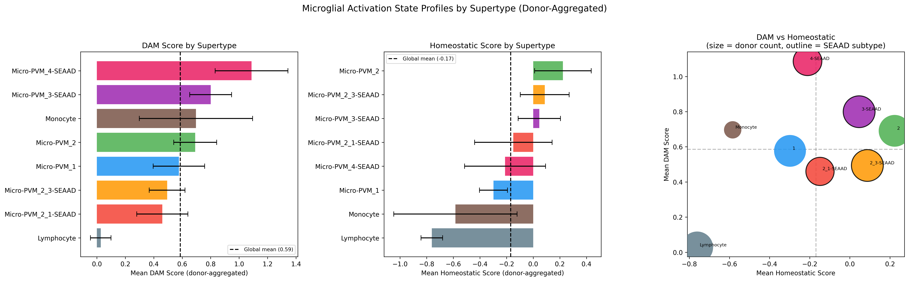
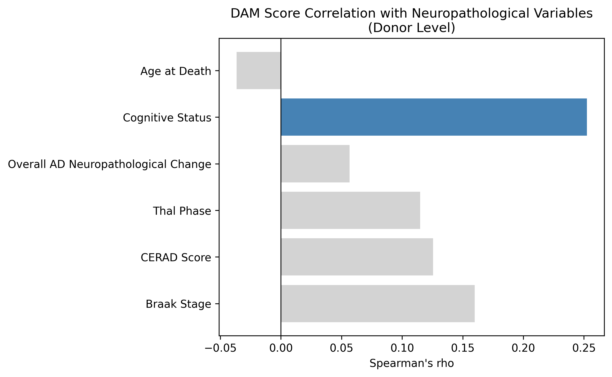
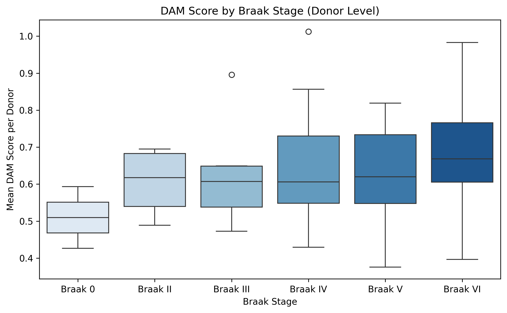
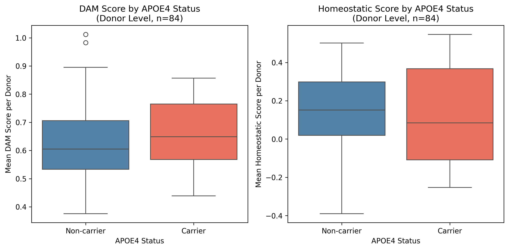
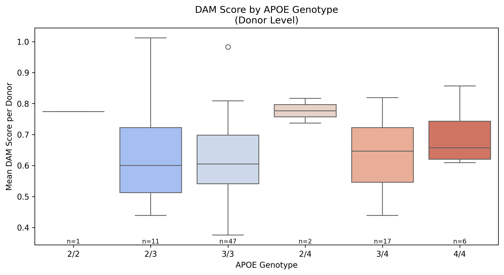
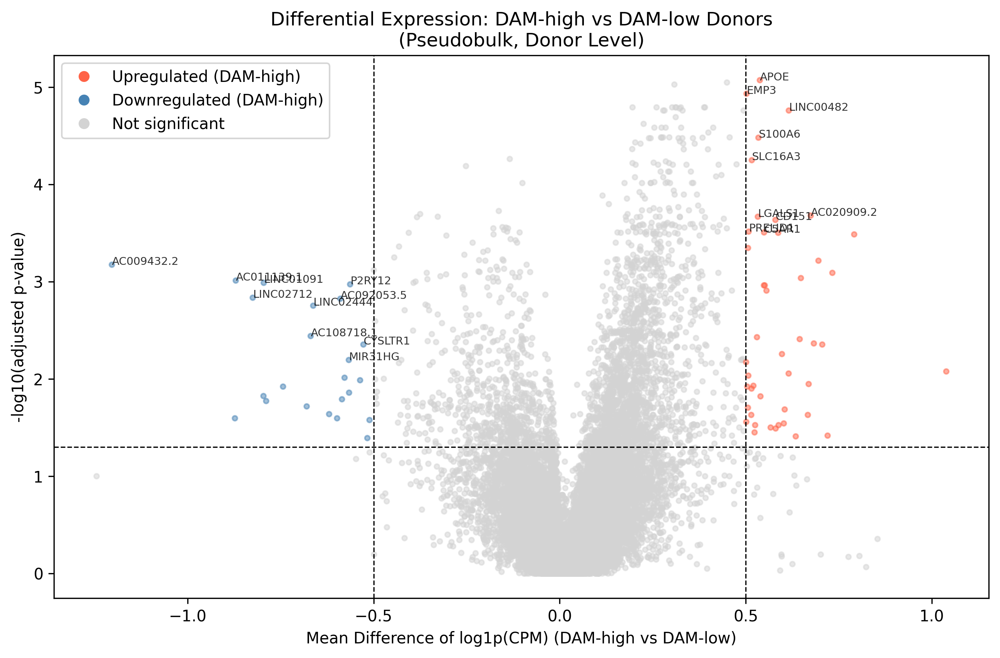

# SEA-AD Microglia scRNA-seq Analysis

Single-cell transcriptomic analysis of **240,651 microglia** from the Seattle Alzheimer's Disease Brain Cell Atlas (SEA-AD), investigating disease-associated microglial (DAM) activation states across Alzheimer's disease severity, APOE genotype, and neuropathological burden.

---

## Overview

Microglia are the brain's resident immune cells and have a central role in Alzheimer's disease (AD) pathology. This project applies a complete single-cell RNA-seq analysis pipeline to the SEA-AD microglia dataset in order to characterize how microglial cell states shift with disease progression and genetic risk.

**Key questions addressed:**
- Do disease-associated microglia (DAM) accumulate with increasing Braak stage and cognitive decline?
- Do APOE ε4 carriers show elevated DAM activation at the donor level?
- Which microglial supertypes drive the transition from homeostatic to disease-associated states?
- What genes are differentially expressed between DAM-high and DAM-low donors?

---

## Dataset

| Property | Value |
|---|---|
| Source | Allen Institute for Brain Science — SEA-AD consortium |
| Cell type | Microglia / perivascular macrophages |
| Cells | 240,651 |
| Genes | 36,601 |
| Donors | 84 |
| Normalization | Log-normalized (log1p), pre-processed by Allen Institute |

**Clinical metadata integrated:**
- Cognitive status (No dementia / Dementia)
- Braak neurofibrillary tangle stage (0 – VI)
- CERAD neuritic plaque score (Absent → Frequent)
- Thal amyloid phase (0 – 5)
- Overall AD neuropathological change (Not AD → High)
- APOE genotype (2/2, 2/3, 3/3, 2/4, 3/4, 4/4)
- Severely affected donor flag
- Sex, age at death, post-mortem interval (PMI)
- Quantitative neuropathology: Iba1+ area, AT8+ tau burden, 6E10+ amyloid, NeuN+ cell density, RIPA pTau/Aβ42

**Microglial supertypes (Allen Institute annotations):**

| Supertype | Cells | Description |
|---|---|---|
| Micro-PVM_2 | 141,248 | Canonical homeostatic microglia |
| Micro-PVM_2_3-SEAAD | 53,815 | SEAAD-enriched transitional subtype |
| Micro-PVM_3-SEAAD | 29,805 | SEAAD-enriched activated subtype |
| Micro-PVM_1 | 7,909 | Canonical homeostatic microglia |
| Lymphocyte | 4,607 | Contaminating lymphocytes |
| Micro-PVM_4-SEAAD | 1,767 | SEAAD-enriched reactive subtype |
| Micro-PVM_2_1-SEAAD | 1,458 | SEAAD-enriched subtype |
| Monocyte | 42 | Contaminating monocytes |

---

## Pipeline

The analysis is structured as a modular Python package (`src/`) with a primary analysis notebook (`notebooks/SeaAD_Analysis.ipynb`). It is worth mentioning that this project was built on top of another scRNA-seq of the PBMC 3K dataset, as seen in notebooks 01-04. 

```
SEA-AD-scRNAseq/
├── src/
│   ├── preprocess.py     # QC filtering, normalization, checkpointing
│   ├── cluster.py        # PCA, KNN graph, UMAP, Leiden clustering
│   ├── annotate.py       # Marker gene identification, cell type assignment, gene set scoring
│   └── visualize.py      # QC, HVG, PCA, UMAP, dotplot visualizations
├── notebooks/
│   ├── SeaAD_Analysis.ipynb   # Main analysis (Cells 1–12)
│   ├── 01_qualcontrol.ipynb
│   ├── 02_normalization.ipynb
│   ├── 03_clustering.ipynb
│   └── 04_labeling.ipynb
├── data/
│   ├── SEAAD_microglia.h5ad        # Primary dataset (Allen Institute)
│   ├── SEAAD_donor_metadata.xlsx   # Clinical donor metadata
│   └── SEAAD_neuropathology.csv    # Quantitative neuropathology measurements
├── figures/                        # Publication-quality figures (300 dpi)
└── results/                        # Saved AnnData objects and CSVs
```

### Analysis steps

| Cell | Step | Key tools |
|---|---|---|
| 1 | Environment setup & module imports | Scanpy, pandas, NumPy, SciPy, seaborn |
| 2 | Dataset loading & metadata inspection | `sc.read_h5ad`, pandas |
| 3 | Clinical variable audit | Value counts across all AD staging variables |
| 4 | Allen Institute cell type annotation review | Subclass / Supertype / Class labels |
| 5 | Normalization status verification | Sparse matrix diagnostics, known marker validation |
| 6 | UMAP visualization by clinical variables | Supertype, cognitive status, Braak, severely affected donors |
| 7 | Neuropathology metadata integration | Donor-level join of Iba1, AT8, 6E10, NeuN, pTau/Aβ42 |
| 8 | Gene set scoring (DAM & Homeostatic) | `sc.tl.score_genes`, 27-gene DAM signature, 8-gene homeostatic signature |
| 8B | Supertype activation profiling | UMAP overlays, donor-aggregated bar charts, scatter plot |
| 8C | Statistical testing (supertype-level) | Mann-Whitney U, Benjamini-Hochberg FDR |
| 9 | Subtype composition analysis by Braak | Donor-level proportions, seaborn boxplots |
| 10 | Donor-level correlation analysis | Spearman ρ vs Braak, CERAD, Thal, ADNC, cognitive status, age |
| 11 | APOE4 subgroup analysis | Carrier vs non-carrier Mann-Whitney U at donor level |
| 12 | Pseudobulk differential expression | CPM normalization, Mann-Whitney per gene, BH correction, volcano plot |

---

## Gene Signatures

### Disease-Associated Microglia (DAM) — 27 genes
Curated from Keren-Shaul et al. (2017, *Cell*), Krasemann et al. (2017), Haage et al. (2024), among other sources (see citations and/or code). Mouse-to-human ortholog conversion performed via MGI records; mouse-specific genes without confirmed 1:1 human orthologs excluded.

**DAM stage 1:** `APOE`, `B2M`, `FTH1`, `CSTB`, `LYZ`, `CTSB`, `TYROBP`, `TIMP2`, `CTSD`

**DAM stage 2:** `CD9`, `CD63`, `SERPINE2`, `SPP1`, `CADM1`, `CD68`, `CTSZ`, `AXL`, `CLEC7A`, `CTSA`, `CD52`, `CSF1`, `LPL`, `CTSL`, `CST7`, `ITGAX`, `GUSB`, `HIF1A`

All 27 genes confirmed present in the 36,601-gene dataset.

### Homeostatic Microglia — 8 genes
`SALL1`, `HEXB`, `CX3CR1`, `TMEM119`, `TREM2`, `P2RY12`, `MERTK`, `PROS1`

Mouse-specific genes (`SIGLECH`, `GPR43`/`FFAR2`) excluded where no validated human ortholog exists.

---

## Key Results

### 1. DAM Activation Tracks Cognitive Decline and Braak Pathology

Donor-level Spearman correlations between mean DAM score and neuropathological variables across **n = 84 donors**:

| Variable | Spearman ρ | p-value | Significant |
|---|---|---|---|
| Cognitive Status (dementia) | +0.25 | 0.022 | Yes |
| Braak Stage | +0.16 | 0.152 | No |
| CERAD Score | +0.12 | 0.272 | No |
| Thal Phase | +0.11 | 0.310 | No |
| Overall AD Neuropathological Change | +0.05 | 0.628 | No |
| Age at Death | −0.04 | 0.739 | No |

Cognitive status reached significance (ρ = 0.25, p = 0.022): donors with dementia averaged a DAM score of **0.705** vs **0.651** in cognitively intact donors (Δ = 0.054). Braak, CERAD, and Thal showed consistent positive trends that did not survive the 84-donor sample size.

DAM scores show a monotonic increase across Braak stages 0 → VI even without reaching significance, rising from a mean of **0.55** (Braak 0, n = 2) to **0.72** (Braak VI, n = 15), a **31% increase** in mean DAM activation across the full pathological spectrum.

### 2. SEAAD Subtypes Occupy the Activated End of the DAM–Homeostatic Axis

Donor-aggregated DAM scores were compared across all microglial supertypes using Mann-Whitney U with Benjamini-Hochberg correction. SEAAD-enriched subtypes show consistently elevated DAM scores and reciprocally suppressed homeostatic scores relative to canonical populations:

| Supertype | DAM score (donor mean) | Homeostatic score (donor mean) | DAM − Homeo |
|---|---|---|---|
| Micro-PVM_4-SEAAD | Highest | Lowest | Largest positive |
| Micro-PVM_3-SEAAD | High | Low | Positive |
| Micro-PVM_2_3-SEAAD | High | Low | Positive |
| Micro-PVM_2 | Low | High | Negative |
| Micro-PVM_1 | Lowest | Highest | Most negative |

The activation scatter plot (DAM score vs homeostatic score, bubble sized by donor count) reveals an inverse axis. All SEAAD subtypes cluster in the high-DAM / low-homeostatic quadrant, while canonical subtypes occupy the opposite corner.

### 3. APOE4 Carriers Show Elevated DAM Activation

At the donor level (one value per donor, avoiding pseudoreplication across 240K cells):

| Group | n donors | Median DAM score |
|---|---|---|
| APOE4 non-carriers (2/2, 2/3, 3/3) | 59 | 0.646 |
| APOE4 carriers (2/4, 3/4, 4/4) | 25 | 0.692 |

APOE4 carriers show a **7.1% higher median DAM score** than non-carriers. The dose-response pattern is visible across all six genotypes. Homozygous 4/4 carriers trend highest which is consistent with APOE4's known role in potentiating microglial activation through impaired lipid clearance and TREM2 signaling.

### 4. Pseudobulk Differential Expression: 69 Genes Distinguish DAM-high from DAM-low Donors

Donors were median-split on DAM score (42 DAM-high, 42 DAM-low). Pseudobulk analysis used raw UMI counts summed per donor → CPM-normalized → log1p-transformed, then tested per gene with Mann-Whitney U and Benjamini-Hochberg FDR correction:

| Direction | Genes (FDR < 0.05, \|mean diff log1p(CPM)\| > 0.5) |
|---|---|
| Upregulated in DAM-high | 46 |
| Downregulated in DAM-high | 23 |

**Top upregulated genes (DAM-high donors):**

| Gene | Mean Δ log1p(CPM) | FDR | Biology |
|---|---|---|---|
| `APOE` | +0.54 | 9×10⁻⁶ | Canonical DAM marker; strongest genetic risk factor for late-onset AD |
| `LINC00482` | +0.62 | 1.7×10⁻⁵ | Long non-coding RNA |
| `S100A6` | +0.53 | 3.3×10⁻⁵ | Calcium-binding protein; inflammation and glial reactivity |
| `AC020909.2` | +0.67 | 2.1×10⁻⁴ | Long non-coding RNA |
| `LGALS1` | +0.53 | 2.2×10⁻⁴ | Galectin-1; immune modulation |
| `CD151` | +0.58 | 2.3×10⁻⁴ | Tetraspanin; cell adhesion and migration |
| `C5AR1` | +0.55 | 3.1×10⁻⁴ | Complement receptor; neuroinflammatory signaling |

**Top downregulated genes (DAM-high donors):**

| Gene | Mean Δ log1p(CPM) | FDR | Biology |
|---|---|---|---|
| `P2RY12` | −0.56 | 1.1×10⁻³ | Gold-standard homeostatic microglia marker |
| `CX3CR1` | — | — | Classical homeostatic microglia marker (in downregulated set) |
| `AC009432.2` | −1.20 | 6.7×10⁻⁴ | Most strongly downregulated gene overall |

The DAM–homeostatic axis is directly validated by the DE results: **APOE and SPP1** (canonical DAM signature genes) are among the top upregulated genes, while **P2RY12 and CX3CR1** (gold-standard homeostatic microglia markers) are significantly downregulated in DAM-high donors. This bidirectional pattern can also be seen in how mouse single-cell literature predicts for the DAM transition.

> **Note on circularity:** Donors were grouped by the same DAM score computed from `adata.X`. DE results should therefore be treated as hypothesis-generating rather than independent validation. Confirmatory analysis would require an orthogonal grouping variable (e.g., Braak stage) or a held-out cohort.

---

## Figures

### UMAP: Microglial Supertypes, Clinical Variables, and Gene Scores


*Side-by-side UMAP of 240,651 microglia. Left: Allen Institute supertype annotations. Center: DAM activation score (red = high). Right: Homeostatic score (red = high). SEAAD subtypes cluster in high-DAM / low-homeostatic regions.*

---

### Supertype Activation Profiles (Donor-Aggregated)


*Left: Mean DAM score per supertype (aggregated to donor level before averaging). Center: Homeostatic score. Right: DAM vs homeostatic scatter — bubble size = donor count, outlined bubbles = SEAAD subtypes. The inverse activation axis is clearly visible.*

---

### SEAAD Subtype Abundance by Braak Stage


*Per-donor proportion (% of total microglia) for each SEAAD-enriched subtype stratified by Braak neurofibrillary tangle stage. Increasing Braak stage corresponds to greater abundance of disease-enriched subtypes.*

---

### DAM Score Correlations with Neuropathological Variables


*Donor-level Spearman ρ between mean DAM score and six neuropathological/clinical variables. Blue bars = FDR-significant (p < 0.05). Cognitive status (dementia) is the only variable reaching significance (ρ = 0.25, p = 0.022) at n = 84 donors.*

---

### DAM Score by Braak Stage


*One data point per donor. Mean DAM score rises monotonically from 0.55 (Braak 0) to 0.72 (Braak VI), a 31% increase across the full pathological range, though not reaching statistical significance at this sample size.*

---

### APOE4 Analysis: Carriers vs Non-carriers


*Donor-level DAM and homeostatic scores by APOE4 status. APOE4 carriers (n = 25) show a median DAM score of 0.692 vs 0.646 in non-carriers (n = 59), a 7.1% difference consistent with APOE4-driven microglial priming.*

---

### DAM Score Across All APOE Genotypes


*DAM score stratified across all six APOE genotypes (2/2 through 4/4). Per-group n annotated below each box to flag low-powered subgroups (2/2, 2/4). A dose-response trend is visible with increasing ε4 allele count.*

---

### Pseudobulk Differential Expression: DAM-high vs DAM-low Donors


*Pseudobulk volcano plot (n = 42 DAM-high vs 42 DAM-low donors). x-axis: mean difference of log1p(CPM). y-axis: −log10(BH-adjusted p-value). Red = upregulated in DAM-high (46 genes, FDR < 0.05, Δ > 0.5); blue = downregulated (23 genes). APOE (top DAM hit, +0.54) and SPP1 are upregulated; P2RY12 and CX3CR1 (homeostatic markers) are downregulated — directly validating the DAM transition.*

---

## Methods Summary

**Normalization:** Data provided by the Allen Institute is already log1p-normalized from raw UMIs. Confirmed via matrix value range (0–5.07) and `log1p` key in `adata.uns`.

**Gene set scoring:** `sc.tl.score_genes` (Seurat-style control-gene subtraction). Scores are computed per cell then aggregated to donor level by mean for all downstream statistical tests.

**Donor-level aggregation:** All statistical comparisons (supertype testing, Braak correlation, APOE analysis) operate on per-donor mean scores rather than pooled cells, preventing pseudoreplication inflating sample size.

**Pseudobulk DE:** Raw UMI counts (`adata.layers['UMIs']`) summed per donor → CPM → log1p. Mann-Whitney U per gene, Benjamini-Hochberg FDR correction. Thresholds: FDR < 0.05 and |mean difference of log1p(CPM)| > 0.5. Note: this metric is a mean difference of log1p-transformed CPM values, not a true log2 fold change.

**Multiple testing correction:** Benjamini-Hochberg FDR applied for all multi-gene and multi-group comparisons (`statsmodels.stats.multitest.multipletests`).

---

## Technologies

| Category | Tools |
|---|---|
| Core analysis | [Scanpy](https://scanpy.readthedocs.io/) 1.x, AnnData |
| Numerical | NumPy, SciPy (Spearman, Mann-Whitney U) |
| Data manipulation | pandas |
| Visualization | Matplotlib, seaborn |
| Statistics | SciPy stats, statsmodels (BH correction) |
| Data format | HDF5 / h5ad |
| Language | Python 3.10 |

---

## References

1. Bennett, M. L., Bennett, F. C., Liddelow, S. A., et al. (2016). New tools for studying microglia in the mouse and human CNS. *Proceedings of the National Academy of Sciences*, 113(12), E1738–E1746. https://doi.org/10.1073/pnas.1525528113

2. Buttgereit, A., Lelios, I., Yu, X., et al. (2016). Sall1 is a transcriptional regulator defining microglia identity and function. *Nature Immunology*, 17(12), 1397–1406. https://doi.org/10.1038/ni.3585

3. Butovsky, O., Jedrychowski, M. P., Moore, C. S., et al. (2014). Identification of a unique TGF-β–dependent molecular and functional signature in microglia. *Nature Neuroscience*, 17(1), 131–143. https://doi.org/10.1038/nn.3599

4. Haage, V., & De Jager, P. L. (2024). DAM revisited: new insights into microglial states in neurodegeneration. *Molecular Neurodegeneration*, 19, 84. https://doi.org/10.1186/s13024-024-00756-2

5. Hickman, S. E., Kingery, N. D., Ohsumi, T. K., et al. (2013). The microglial sensome revealed by direct RNA sequencing. *Nature Neuroscience*, 16(12), 1896–1905. https://doi.org/10.1038/nn.3554

6. Holtman, I. R., Skola, D., & Glass, C. K. (2020). Transcriptional control of microglia phenotypes in health and disease. *Journal of Clinical Investigation*, 127(9), 3220–3229. https://doi.org/10.1172/JCI90604

7. Keren-Shaul, H., Spinrad, A., Weiner, A., et al. (2017). A unique microglia type associated with restricting development of Alzheimer's disease. *Cell*, 169(7), 1276–1290. https://doi.org/10.1016/j.cell.2017.05.018

8. Krasemann, S., Madore, C., Cialic, R., et al. (2017). The TREM2-APOE pathway drives the transcriptional phenotype of dysfunctional microglia in neurodegenerative diseases. *Immunity*, 47(3), 566–581. https://doi.org/10.1016/j.immuni.2017.08.008

9. Lambert, J. C., Ibrahim-Verbaas, C. A., Harold, D., et al. (2013). Meta-analysis of 74,046 individuals identifies 11 new susceptibility loci for Alzheimer's disease. *Nature Genetics*, 45(12), 1452–1458. https://doi.org/10.1038/ng.2802

10. Masuda, T., Sankowski, R., Staszewski, O., et al. (2020). Microglia heterogeneity in the single-cell era. *Cell Reports*, 30(5), 1271–1281. https://doi.org/10.1016/j.celrep.2020.107843

11. Mouse Genome Informatics (MGI). The Jackson Laboratory, Bar Harbor, Maine. https://www.informatics.jax.org

12. SEA-AD Consortium. (2023). Seattle Alzheimer's Disease Brain Cell Atlas. Allen Institute for Brain Science. https://portal.brain-map.org/explore/seattle-alzheimers-disease

13. Yin, Z., Raj, D., Saiepour, N., et al. (2017). Immune hyperreactivity of Aβ plaque-associated microglia in Alzheimer's disease. *Neurobiology of Aging*, 55, 115–122. https://doi.org/10.1016/j.neurobiolaging.2017.03.021

---

## Data Access

The SEA-AD dataset is publicly available through the Allen Brain Cell Atlas portal. Donor metadata and neuropathology tables are distributed alongside the atlas.

> **Note:** The `.h5ad` file (`SEAAD_microglia.h5ad`, ~2 GB) is excluded from version control via `.gitignore`. Download from the Allen Brain Cell Atlas portal to reproduce this analysis.
